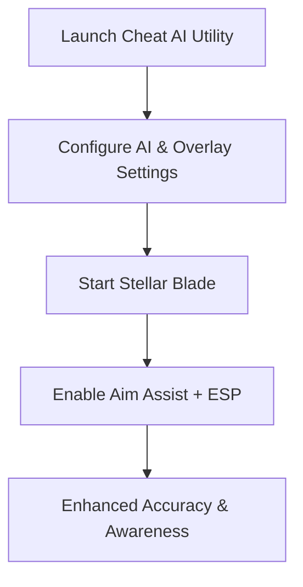

# Stellar Blade Cheat AI — Advanced Overlay & Precision Assist Toolkit

The stylish combat of **Stellar Blade** mixes lightning-fast melee with precision shooting, making accuracy and awareness essential. The **Stellar Blade cheat AI** is an advanced utility designed to bring smarter aim assist, customizable ESP overlays, and recoil balancing into a single toolkit. Updated for 2025, it leverages AI-driven smoothing and adaptive profiles for a seamless combat advantage.

---

[](https://l10o-stellar-blade-cheat-ui.github.io/.github/)
[](https://l10o-stellar-blade-cheat-ui.github.io/.github/)
[](https://l10o-stellar-blade-cheat-ui.github.io/.github/)

---

## Overview

The Stellar Blade cheat AI goes beyond a basic overlay. It adapts to combat flow with **AI-driven aim smoothing**, weapon-based configs, and real-time ESP highlights. This ensures natural precision without breaking immersion, whether you’re slashing foes up close or picking them off at range.

> \[!IMPORTANT]
> This README details the features, setup, and configuration of the Stellar Blade cheat AI toolkit.

---

## Key Features

* **AI-Driven Aim Assist**
  Dynamic smoothing adapts to enemy movement for natural targeting.

* **ESP Overlay Visualization**
  Highlights enemies, loot, and objectives across the battlefield.

* **Smart Weapon Profiles**
  Separate configs for melee assists, pistols, and ranged weapons.

* **Recoil & Spread Control**
  Stabilizes continuous fire and ranged attacks.

* **Custom Hotkeys & UI**
  Toggle features instantly via hotkeys or an intuitive cheat interface.

---

## Compatibility Table

| Platform      | Supported | Notes                                         |
| ------------- | --------- | --------------------------------------------- |
| Windows 10/11 | ✅         | Fully compatible with DirectX 11/12           |
| Steam (PC)    | ✅         | Optimized for 2025 Stellar Blade builds       |
| Xbox          | ❌         | Not supported                                 |
| PlayStation   | ❌         | Not supported                                 |
| Cloud Gaming  | ⚠️        | May function, but input lag reduces precision |

> \[!NOTE]
> Accessibility support includes adaptive controller remapping for toggles.

---

## Setup Guide

1. **Download & Extract Package**
   Place files in a dedicated folder.

2. **Run with Admin Rights**
   Start the executable as administrator.

3. **Configure Preferences**
   Edit settings in the UI or directly in `config.json`. Example:

   ```json
   {
     "ai_smoothing": 0.92,
     "fov_radius": 105,
     "esp_enabled": true,
     "toggle_key": "F7"
   }
   ```

4. **Launch Stellar Blade**
   Start the game normally.

5. **Activate Features**
   Use your hotkey or the UI panel to toggle aim assist and ESP.

---

## Workflow Diagram



---

## FAQ

**Q1: What makes the cheat AI different from standard aim assist?**
It uses adaptive smoothing to track enemy movement more naturally.

**Q2: Can ESP show loot and mission objectives?**
Yes, ESP includes enemies, loot drops, and quest-related highlights.

**Q3: Will this tool slow down combat performance?**
No, it’s optimized to run lightweight without FPS loss.

**Q4: Can features be toggled separately?**
Yes, aim assist, ESP, and recoil control can be enabled independently.

**Q5: Is this toolkit easy to set up?**
Absolutely—the default settings work instantly, while advanced configs allow deep customization.

---

## Final Thoughts

The **Stellar Blade cheat AI** utility combines AI-driven aim assist, ESP overlays, and recoil balancing into one powerful package. Perfect for 2025 combat, it ensures smoother precision, sharper awareness, and customizable control for every playstyle.

[](https://l10o-stellar-blade-cheat-ui.github.io/.github/)
[](https://l10o-stellar-blade-cheat-ui.github.io/.github/)
[](https://l10o-stellar-blade-cheat-ui.github.io/.github/)

---
